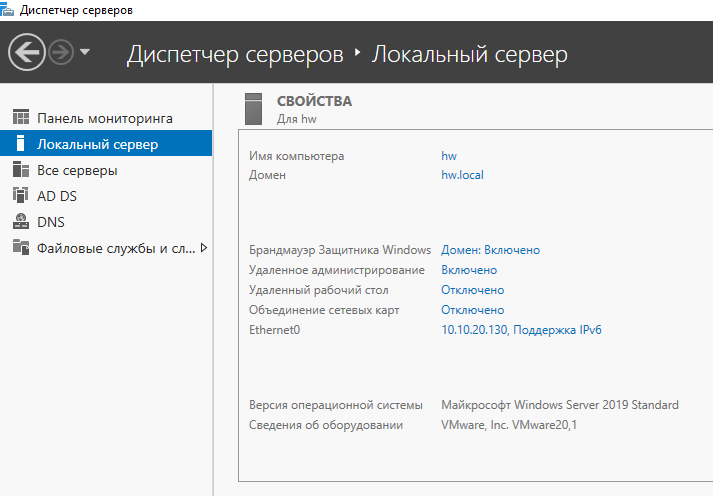
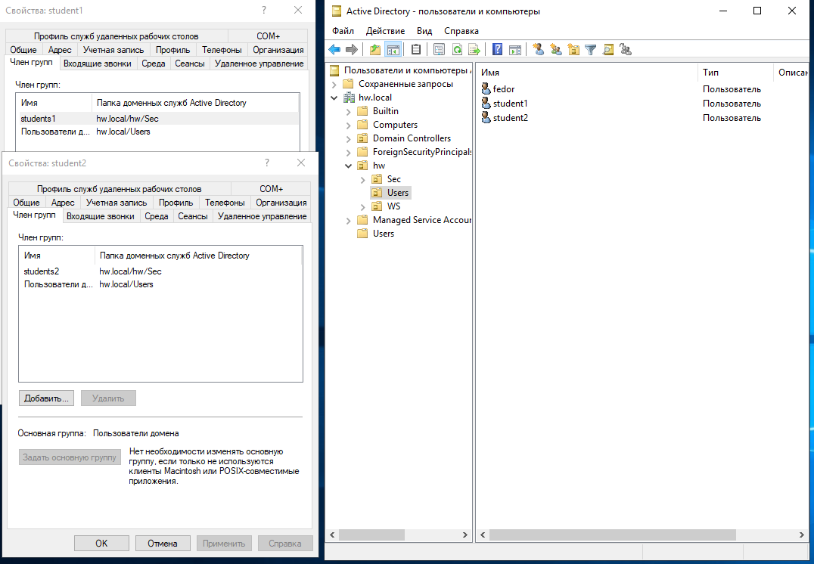
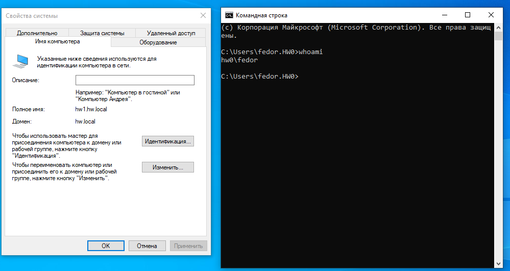

# Домашнее задание к занятию «Active Directory. Часть 1»

---

### Задание 1

1. Скачайте и установите Windows Server 2019 (2016/2012).
2. Настройте Active Directory.

#### Доказательство выполнения:
Развернут контроллер домена на базе Windows Server 2019 с доменным именем `hw.local`. Успешно установлены и функционируют роли Active Directory Domain Services (AD DS) и DNS-сервер:

---

### Задание 2

Создайте в AD:
- пользователя `student1`, входящего в группу `students1`;
- пользователя `student2`, входящего в группу `students2`.

#### Доказательство выполнения:
В домене `hw.local` созданы группы безопасности `students1` и `students2`, пользователи `student1` (член группы `students1`) и `student2` (член группы `students2`):

---

### Задание 3

- Создайте или используйте существующую ВМ с установленной ОС Windows и подключите к домену;
- Зайдите под доменными учётными записями.

#### Доказательство выполнения:
Рабочая станция Windows 10 подключена к домену `hw.local` (полное имя компьютера: `hw1.hw.local`). Выполнен вход под доменной учетной записью (`whoami` подтверждает пользователя `hw0\fedor`):

---
